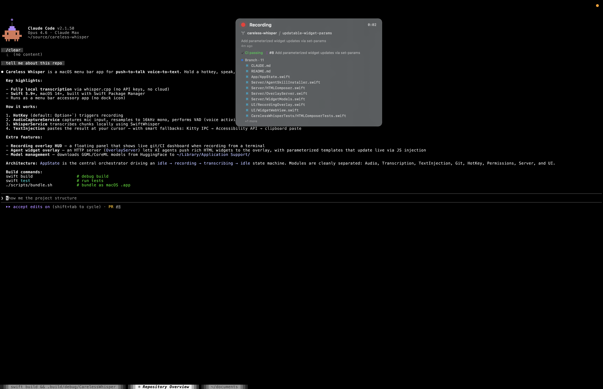

# Careless Whisper

## Install

```bash
brew install --cask tesseric/careless-whisper/careless-whisper
```

### Quick Start

1. Install via `brew install --cask tesseric/careless-whisper/careless-whisper`
2. Launch — a mic icon appears in your menu bar
3. Grant Microphone and Accessibility permissions when prompted
4. Hold <kbd>Option</kbd>+<kbd>`</kbd> and speak — text appears at your cursor

A **native macOS companion for terminal-based agentic coding**. When developers move from IDEs to tools like [Claude Code](https://docs.anthropic.com/en/docs/claude-code), Aider, and GitHub Copilot CLI, they gain the power of autonomous agents — but lose conveniences that GUI editors provided for free: voice input, image pasting, glanceable project status, and rich agent UI. Careless Whisper bridges these gaps from the OS layer, where it can do things terminals fundamentally can't.

- **Voice-to-text** — Hold a hotkey, speak, release. Words appear at your cursor via local Whisper transcription. No API keys, no cloud.
- **Clipboard image attach** — Terminals can't paste images. Copy a screenshot, hold the hotkey, press `1` — the image is saved to disk and its path is injected alongside your speech.
- **Dev dashboard** — A floating HUD shows git status, branch, CI, PR info, and live diffs while you record.
- **Agent overlay** — AI agents push rich HTML widgets (build status, dashboards, visualizations) to the HUD while you work.

[](https://youtu.be/eTeb47Qa5DE)

## How It Works

1. **Hold a hotkey** (default: `Option+`\`) → the mic starts recording and a floating HUD overlay appears
2. **Speak** → Voice Activity Detection (VAD) splits speech into chunks, each transcribed in real-time via [whisper.cpp](https://github.com/ggerganov/whisper.cpp)
3. **Release the hotkey** → the final transcription is assembled and automatically typed into the frontmost app

## Clipboard Image Attach

Terminals can only paste text — when an AI agent asks you to share a screenshot, error dialog, or UI mockup, there's no native way to do it. Careless Whisper bridges this gap:

1. **Copy an image** to your clipboard (e.g. <kbd>Cmd</kbd>+<kbd>Shift</kbd>+<kbd>Ctrl</kbd>+<kbd>4</kbd> for a region screenshot)
2. **Hold the hotkey** — the HUD shows "Image on clipboard — press `1` to attach"
3. **Press `1`** (or click the indicator) — the image is saved as a PNG to `~/.careless-whisper/images/`
4. **Speak** (optional) — e.g. "describe what's in this image"
5. **Release the hotkey** — the transcription + file path are injected together: `describe what's in this image ~/.careless-whisper/images/clipboard-20260222-105710-317.png`

The `1` key is intercepted via a CGEventTap during recording so it doesn't reach the terminal. If there's no image on the clipboard, the indicator doesn't appear and `1` works normally. Images older than 24 hours are automatically pruned.

## Privacy

- **100% local** — all audio is processed on-device via whisper.cpp. No data ever leaves your Mac.
- **No network required** after the initial one-time model download
- **No analytics, telemetry, or accounts** — zero tracking of any kind
- **Localhost only** — the overlay server binds to `127.0.0.1` and uses a random auth token per session
- **Open source** — audit the code yourself

## Terminal-Aware Dev Dashboard

When you record from a terminal (Kitty, iTerm2, Terminal.app, Warp, Ghostty, Alacritty, WezTerm, Hyper), the overlay becomes a live development dashboard:

- **Repo & branch** — detected from the shell's working directory
- **Ahead/behind origin** — `↑2 ↓1` so you know if you need to push or pull
- **Last commit** — message + relative time (e.g. `3m ago`)
- **CI status** — passing / failing / running via the `gh` CLI
- **Open PR** — number + review decision (approved, changes requested, review needed)
- **Branch diff** — files changed on this branch vs `main`
- **Staged & unstaged files** — with colored status indicators (`A` added, `M` modified, `D` deleted)
- **Stash count** — when you have stashed changes
- **Live diff preview** — actual `+`/`−` lines with context for every unstaged modified file

All of this context appears in the floating HUD while you're recording — a glanceable snapshot of your working state without leaving the terminal.

## Agent Overlay

AI agents like [Claude Code](https://docs.anthropic.com/en/docs/claude-code) can push rich HTML widgets to the floating overlay while you work. Enable **Agent Integration** in Settings to start the local overlay server and install the Claude Code skill automatically.

When agent widgets are visible and you start recording, the overlay expands into a **dual-column layout** — your git context on one side, agent widgets on the other — giving you a complete picture of what both you and your agent are doing.

### Pre-built widget templates

Agents can create common widgets without composing any HTML. Set a `template` name and `params` — the server generates styled, Dracula-themed HTML automatically:

| Template | Purpose | Example params |
|---|---|---|
| `progress` | Progress bar with label | `label`, `pct`, `status` |
| `steps` | Vertical pipeline/timeline | `labels`, `statuses`, `details` |
| `metrics` | Grid of metric cards | `values`, `labels` |
| `table` | Data table | `headers`, `rows` |
| `status-list` | Items with status badges | `labels`, `statuses` |
| `message` | Notification card | `text`, `type`, `detail` |
| `key-value` | Key-value pairs | `keys`, `values` |
| `bar-chart` | SVG bar chart | `labels`, `values` |

Templates and raw HTML widgets can be mixed in the same display. Custom HTML/CSS/SVG remains available for specialized visualizations (sparklines, radar charts, heatmaps, etc.).

### Custom widgets

For visualizations that templates can't express, agents send raw HTML directly. Widgets support a `params` dictionary with `{{key}}` template placeholders. Agents can update individual parameter values live via `set-params` — the overlay updates in-place via JavaScript injection with no flicker, so CSS transitions animate smoothly.

### How it works

1. Enable **Agent Integration** in Settings
2. A local HTTP server starts on `127.0.0.1` with bearer token auth
3. A Claude Code skill is auto-installed to `~/.claude/skills/overlay/`
4. The skill auto-updates on app launch when new templates or docs are available
5. Agents use the `overlay-cli` script to show, update, set-params, and dismiss widgets
6. Run `~/.claude/skills/overlay/demo.sh` to see all visualization types in action

The server binds to localhost only, uses a random auth token per session, and the discovery file (`~/.careless-whisper/server.json`) is restricted to owner-only permissions. Stale temp files from previous sessions are cleaned up automatically on server start.

## Features

- **Local transcription** via [SwiftWhisper](https://github.com/exPHAT/SwiftWhisper) (whisper.cpp) — no API keys or internet required
- **Three English model sizes**: Tiny (75 MB), Base (142 MB), Small (466 MB), downloaded from HuggingFace
- **Silence filtering** — Whisper hallucinations like `[silence]`, `[music]`, `[noise]` are automatically suppressed
- **Live transcription preview** in a floating non-activating overlay during recording
- **Customizable hotkey** with presets (Option+\`, F5, Ctrl+Shift+Space, F19)
- **Input device selection** with multiple microphone support via CoreAudio
- **Smart text injection**:
  - Kitty terminal → native IPC via `kitten @ send-text`
  - Accessibility API → direct text field injection
  - All other apps → clipboard + simulated Cmd+V (original clipboard restored afterwards)
- **Optional auto-Enter** after transcription
- **Completion sound** toggle
- **Recent transcription history** (last 20) accessible from the menu bar
- **Launch at login** support via `SMAppService`
- **Auto-stop** after 60 seconds of recording

## Requirements

- macOS 14 (Sonoma) or later
- **Microphone permission** — for audio capture
- **Accessibility permission** — for simulating keystrokes (Cmd+V paste)
- **`gh` CLI** (optional) — enables CI status and PR info in the overlay

## Building

```bash
# Debug build
swift build

# Release build
swift build -c release
```

### Creating an App Bundle

```bash
# Debug
./scripts/bundle.sh

# Release
./scripts/bundle.sh --release
```

The `.app` bundle is output to `./build/CarelessWhisper.app`. Copy it to `/Applications` to install:

```bash
cp -r build/CarelessWhisper.app /Applications/
```

## Architecture

```
CarelessWhisperApp (entry point)
├── AppState          — central @MainActor orchestrator (idle → recording → transcribing → idle)
├── StatusBarController — NSStatusBar menu with status, history, and actions
│
├── Audio/
│   ├── AudioCaptureService — AVAudioEngine tap, 16 kHz mono resampling, VAD chunking
│   └── AudioBuffer         — os_unfair_lock thread-safe accumulator for real-time audio thread
│
├── Transcription/
│   ├── WhisperService — SwiftWhisper wrapper (Task.detached to avoid MainActor deadlock)
│   └── ModelManager   — model download, storage, and caching (~/.../Application Support/)
│
├── TextInjection/
│   ├── TextInjectorCoordinator — strategy router (Kitty IPC → Accessibility → clipboard fallback)
│   ├── KittyIPC               — Kitty terminal socket discovery and remote control
│   ├── AccessibilityInjector  — direct AXUIElement text field injection
│   └── ClipboardPaster        — clipboard + CGEvent keystroke simulation
│
├── Git/
│   └── GitContextService — terminal detection, process tree CWD discovery,
│                           git status/branch/diff parsing, GitHub CI/PR via gh CLI
│
├── Server/
│   ├── OverlayServer        — NWListener HTTP server (localhost, bearer token auth)
│   ├── HTTPConnection       — single-connection HTTP/1.1 request parser + response writer
│   ├── HTMLComposer         — widget HTML composition, sanitization, and CSP
│   ├── WidgetModels         — Codable widget/request/response types
│   ├── WidgetTemplateRegistry — 8 pre-built widget templates (progress, steps, metrics, etc.)
│   └── AgentSkillInstaller  — auto-installs Claude Code skill + CLI with content-hash versioning
│
├── Clipboard/
│   └── ClipboardImageService — detect, save, and auto-prune clipboard images
│
├── HotKey/
│   ├── HotKeyManager  — global hotkey registration with UserDefaults persistence
│   └── KeyInterceptor — CGEventTap to intercept/suppress '1' key during recording
│
├── Permissions/
│   └── PermissionChecker — microphone + accessibility permission handling
│
└── UI/
    ├── SettingsView/Window  — SwiftUI settings (hotkey, model, device, toggles)
    ├── RecordingOverlay     — floating NSPanel HUD with dual-column dev dashboard
    ├── WidgetWebView        — WKWebView wrapper for rendering agent HTML widgets
    ├── WidgetWebViewBridge  — JS injection bridge for live param updates without reload
    └── MenuBarView          — SwiftUI menu bar content
```

## Settings

Access settings from the menu bar icon. Available options:

| Setting | Description |
|---------|-------------|
| **Hotkey** | Push-to-talk key combo with preset options |
| **Whisper Model** | Tiny, Base, or Small (English-only) |
| **Input Device** | Select from available microphones |
| **Completion Sound** | Play a sound when transcription finishes |
| **Press Enter** | Automatically press Enter after injecting text |
| **Launch at Login** | Start the app automatically on login |
| **Agent Integration** | Enable overlay server for AI agent widgets |

## Dependencies

- [SwiftWhisper](https://github.com/exPHAT/SwiftWhisper) — whisper.cpp Swift bindings
- [HotKey](https://github.com/soffes/HotKey) — global hotkey registration
- WebKit (system) — agent widget HTML rendering
- Network (system) — overlay HTTP server

## License

See [LICENSE](LICENSE) for details.
